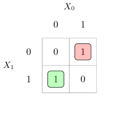

# karnaugh-map
This package draws [karnaugh maps](https://en.wikipedia.org/wiki/Karnaugh_map) with 2, 3, 4, 5, and 6 variables.
It also contains commands for filling the karnaugh map with terms semi-automatically or manually.
Last but not least it contains commands for drawing implicants on top of the map.
Below is an example of a two variable karnaugh map.

## Installation
    # to get the karnaugh-map.sty file
    pdflatex karnaugh-map.ins
    # to get the documentation: karnaugh-map.pdf
    pdflatex karnaugh-map.dtx

## Dependencies
* keyval
* kvoptions
* tikz
* xparse
* xstring

## Development
The karnaugh-map package source is hosted at [https://github.com/2pi/karnaugh-map](https://github.com/2pi/karnaugh-map) as well as the [bugtracker](https://github.com/2pi/karnaugh-map/issues).

## Tests
    ./test.sh
Testing consists of building the pdf output from the test files, and then comparing them to how they are expected to look like.
Comparison is done with help from [diff-pdf](https://github.com/vslavik/diff-pdf).
All of this is done by running the `test.sh` file from the project root folder.
If there is a difference, between the actual and expected output, a diff will be written to the folder `test/result`.

## License
This work, karnaugh-map, is written from the ground up by Mattias Jacobsson. However the general implementation idea is based on the work published on [TeX - LaTeX Stack Exchange](https://tex.stackexchange.com) by [Ignasi](https://tex.stackexchange.com/users/1952/ignasi) found [here](https://tex.stackexchange.com/a/140581) and [here](https://tex.stackexchange.com/a/36879) which is licensed under [CC BY-SA](https://creativecommons.org/licenses/by-sa/3.0/). karnaugh-map is therefore licensed under [CC BY-SA](https://creativecommons.org/licenses/by-sa/3.0/). Contributors include [Oscar Gustafsson](https://github.com/oscargus).
